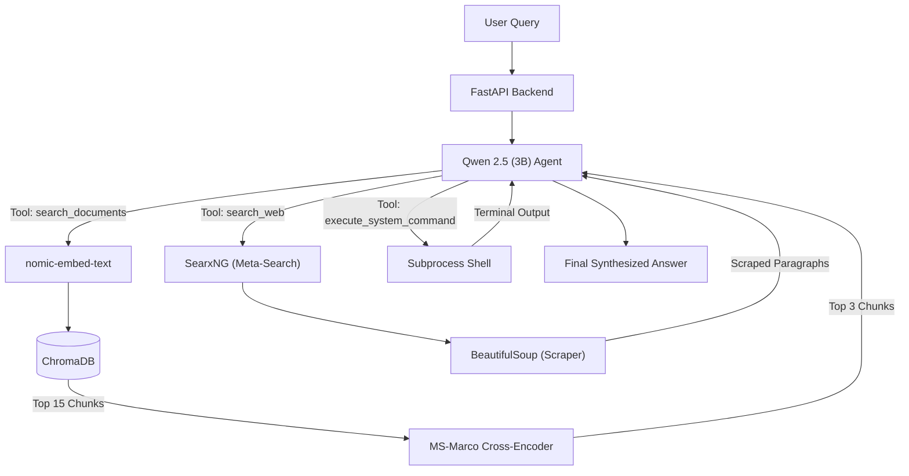

# RAG Ops Lab 


RAG Ops Lab is an autonomous, locally-hosted DevOps AI assistant. It combines a highly advanced **Two-Stage RAG pipeline**, native **Agentic Function Calling**, and live **Web Scraping** to create an AI that doesn't just chat—it researches, analyzes, and executes system commands on your behalf.

Everything runs locally, ensuring 100% privacy and requiring only 4GB of VRAM.

---

## ✨ Key Features

- **Agentic Function Calling:** Powered by Alibaba's `qwen2.5:3b`, the agent natively decides when to search your documents, browse the live web, or execute bash commands.
- **Two-Stage RAG Pipeline:** 
  - *Stage 1 (Retrieval):* Uses `nomic-embed-text` and **ChromaDB** for lightning-fast dense vector retrieval.
  - *Stage 2 (Re-ranking):* Passes the top 15 results through an `ms-marco-MiniLM` **Cross-Encoder** to mathematically re-rank and filter out irrelevant context, preventing hallucinations.
- **Live Web Research:** Integrated with a self-hosted **SearxNG** instance. When the AI doesn't know an answer, it autonomously searches the internet, scrapes the top 3 URLs, and synthesizes a cited report.
- **Host System Execution:** The AI can execute raw Linux bash commands on the host server to check logs, monitor resources, or manipulate files.
- **Dynamic UI Control:** A React-based cyberpunk dashboard that monitors ChromaDB ingestion in real-time and allows you to hardware-toggle the AI's internet access.

---

## 🏗️ Architecture



---

## 🛠️ Technology Stack

| Component | Tech Used | Purpose |
| :--- | :--- | :--- |
| **LLM (Brain)** | `qwen2.5:3b` | Reasoning, Tool Selection, Synthesis |
| **Embedding** | `nomic-embed-text` | Fast dense vector retrieval |
| **Cross-Encoder** | `ms-marco-MiniLM-L-6-v2` | Precision semantic re-ranking |
| **Vector DB** | ChromaDB | Persistent document storage |
| **Search Engine**| SearxNG | Private web searching |
| **Backend** | FastAPI (Python) | API routing and orchestration |
| **Frontend** | React + Vite | UI and real-time system monitor |
| **DevOps** | Docker Compose | Containerization & Bind mounts |

---

## 🚀 Quick Start

### 1. Clone the repository
```bash
git clone https://github.com/kamal-v8/rag-ops-lab.git
cd rag-ops-lab
```

### 2. Start the infrastructure
Ensure you have Docker and Docker Compose installed.
```bash
docker compose -f docker-compose.yaml -f docker-compose.nvidia.yaml up -d
```
*(Note: Omit `-f docker-compose.nvidia.yaml` if you are not running on an NVIDIA GPU)*

### 3. Pull the AI Models
Once Ollama is running, download the required models into your persistent bind mount:
```bash
docker compose exec ollama ollama pull qwen2.5:3b
docker compose exec ollama ollama pull nomic-embed-text
```

### 4. Access the UI
Open your browser and navigate to:
```text
http://localhost:3000
```

---

## 📁 Project Structure

- `/backend/` - FastAPI application, Agentic Loop, and Cross-Encoder logic.
- `/frontend/` - React SPA with real-time UI components.
- `/chroma-data/` - Persistent storage for vectorized documents.
- `/ollama_data/` - Persistent storage for LLM weights.
- `.github/workflows/` - CI/CD pipeline configuration.

---

## 📝 License
MIT License
